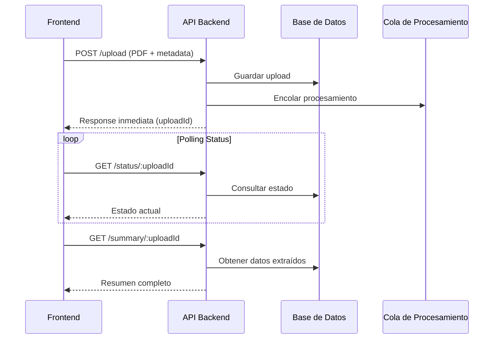

# Guía de Integración Frontend - API de Historia Laboral

Este documento proporciona las directrices para integrar la API de Historia Laboral desde aplicaciones frontend, incluyendo carga de archivos PDF y consulta de resultados de procesamiento.

## 📋 Índice

1. [Endpoint de Carga de Archivos](#endpoint-de-carga-de-archivos)
2. [Endpoints de Consulta de Estado](#endpoints-de-consulta-de-estado)
3. [Flujo Completo de Integración](#flujo-completo-de-integración)
4. [Ejemplos de Código](#ejemplos-de-código)
5. [Manejo de Respuestas](#manejo-de-respuestas)
6. [Recomendaciones](#recomendaciones)

## Endpoint de Carga de Archivos

### Información General

- **URL**: `https://[dominio]/optipension/api/history-laboral/upload`
- **Método**: `POST`
- **Autenticación**: JWT Bearer Token (Auth0)
- **Tipo de Contenido**: `multipart/form-data`

### Requisitos para la Carga de Archivos

| Parámetro | Valor |
|-----------|-------|
| Tipo de archivo | PDF únicamente |
| Extensión | .pdf |
| Tamaño máximo | 2MB |
| Nombre del campo | file |
| Rate Limit | 3 solicitudes por minuto |

### Campos Adicionales

| Campo | Tipo | Descripción | Requerido |
|-------|------|-------------|-----------|
| documentType | string | Tipo de documento ("CC", "CE", "TI", "PP") | Sí |
| documentNumber | string | Número de documento (máx. 12 dígitos) | Sí |

## Endpoints de Consulta de Estado

### 1. Consultar Estado de Procesamiento

- **URL**: `https://[dominio]/optipension/api/history-laboral/:uploadId/status`
- **Método**: `GET`
- **Autenticación**: JWT Bearer Token (Auth0)

**Respuesta Esperada:**
```json
{
  "success": true,
  "data": {
    "uploadId": 1,
    "status": "PROCESSED", // PENDING, PROCESSING, PROCESSED, ERROR
    "message": "Procesamiento completado exitosamente",
    "startedAt": "2025-06-09T18:05:18.995Z",
    "completedAt": "2025-06-09T18:05:20.399Z",
    "durationMs": 1404,
    "errorMessage": null
  }
}
```

### 2. Obtener Resumen de Datos Extraídos

- **URL**: `https://[dominio]/optipension/api/history-laboral/:uploadId/summary`
- **Método**: `GET`
- **Autenticación**: JWT Bearer Token (Auth0)

**Respuesta Esperada:**
```json
{
  "success": true,
  "data": {
    "uploadId": 1,
    "fullName": "GERMAN TABARES CARREÑO",
    "document": "79308073",
    "totalWeeks": 1306.57,
    "highRiskWeeks": 0,
    "discrepancyOfWeeks": -0.07,
    "periodsCount": 47,
    "periods": [
      {
        "employerId": "1003901407",
        "employerName": "FILMTEX COLISSIN LTD",
        "from": "1987-07-21",
        "to": "1993-01-14",
        "ibc": 665070,
        "weeks": 286.43,
        "lic": 0,
        "sim": 0,
        "total": 286.43
      }
      // ... más períodos
    ],
    "extractionMeta": {
      "durationMs": 1266,
      "parserVersion": "v1.0.3",
      "pdfSize": 147078
    }
  }
}
```

## Flujo Completo de Integración

### 1. Flujo Recomendado



### 2. Estados de Procesamiento

| Estado | Descripción | Acción Recomendada |
|--------|-------------|-------------------|
| `PENDING` | En cola de procesamiento | Continuar polling |
| `PROCESSING` | Siendo procesado | Continuar polling |
| `PROCESSED` | Completado exitosamente | Obtener resumen |
| `ERROR` | Error en procesamiento | Mostrar error, permitir reintento |

## Ejemplos de Código

### Ejemplo Completo con React + Axios

```jsx
import React, { useState, useEffect } from 'react';
import axios from 'axios';
import { useAuth0 } from '@auth0/auth0-react';

function FileUploader() {
  const [file, setFile] = useState(null);
  const [documentType, setDocumentType] = useState('CC');
  const [documentNumber, setDocumentNumber] = useState('');
  const [loading, setLoading] = useState(false);
  const [uploadId, setUploadId] = useState(null);
  const [status, setStatus] = useState(null);
  const [summary, setSummary] = useState(null);
  const [error, setError] = useState(null);
  const { getAccessTokenSilently } = useAuth0();

  const API_BASE = 'https://[dominio]/optipension/api/history-laboral';

  // Función para cargar archivo
  const handleUpload = async () => {
    if (!file || !documentNumber) {
      setError('Debe seleccionar un archivo y proporcionar el número de documento');
      return;
    }

    setLoading(true);
    setError(null);

    try {
      const token = await getAccessTokenSilently();
      
      const formData = new FormData();
      formData.append('file', file);
      formData.append('documentType', documentType);
      formData.append('documentNumber', documentNumber);
      
      const response = await axios.post(`${API_BASE}/upload`, formData, {
        headers: {
          'Authorization': `Bearer ${token}`,
          'Content-Type': 'multipart/form-data'
        }
      });
      
      if (response.data.success) {
        setUploadId(response.data.uploadId); // Asumiendo que el endpoint retornará uploadId
        startStatusPolling(response.data.uploadId, token);
      }
    } catch (error) {
      setError(error.response?.data?.message || 'Error al cargar el archivo');
      setLoading(false);
    }
  };

  // Función para consultar estado
  const checkStatus = async (uploadId, token) => {
    try {
      const response = await axios.get(`${API_BASE}/${uploadId}/status`, {
        headers: { 'Authorization': `Bearer ${token}` }
      });
      
      return response.data.data;
    } catch (error) {
      console.error('Error al consultar estado:', error);
      return null;
    }
  };

  // Función para obtener resumen
  const getSummary = async (uploadId, token) => {
    try {
      const response = await axios.get(`${API_BASE}/${uploadId}/summary`, {
        headers: { 'Authorization': `Bearer ${token}` }
      });
      
      return response.data.data;
    } catch (error) {
      console.error('Error al obtener resumen:', error);
      return null;
    }
  };

  // Polling de estado
  const startStatusPolling = async (uploadId, token) => {
    const poll = async () => {
      const statusData = await checkStatus(uploadId, token);
      
      if (statusData) {
        setStatus(statusData);
        
        if (statusData.status === 'PROCESSED') {
          const summaryData = await getSummary(uploadId, token);
          if (summaryData) {
            setSummary(summaryData);
          }
          setLoading(false);
        } else if (statusData.status === 'ERROR') {
          setError(statusData.errorMessage || 'Error en el procesamiento');
          setLoading(false);
        } else {
          // Continuar polling si está PENDING o PROCESSING
          setTimeout(poll, 2000);
        }
      }
    };
    
    poll();
  };

  return (
    <div className="file-uploader">
      <h2>Carga de Historia Laboral</h2>
      
      {/* Formulario de carga */}
      <div className="upload-form">
        <div>
          <label>Tipo de Documento:</label>
          <select 
            value={documentType} 
            onChange={(e) => setDocumentType(e.target.value)}
            disabled={loading}
          >
            <option value="CC">Cédula de Ciudadanía</option>
            <option value="CE">Cédula de Extranjería</option>
            <option value="TI">Tarjeta de Identidad</option>
            <option value="PP">Pasaporte</option>
          </select>
        </div>
        
        <div>
          <label>Número de Documento:</label>
          <input 
            type="text" 
            value={documentNumber}
            onChange={(e) => setDocumentNumber(e.target.value)}
            placeholder="Ej: 1234567890"
            maxLength="12"
            disabled={loading}
          />
        </div>
        
        <div>
          <label>Archivo PDF:</label>
          <input 
            type="file" 
            accept=".pdf,application/pdf"
            onChange={(e) => setFile(e.target.files[0])}
            disabled={loading}
          />
        </div>
        
        <button onClick={handleUpload} disabled={loading || !file || !documentNumber}>
          {loading ? 'Procesando...' : 'Cargar Archivo'}
        </button>
      </div>

      {/* Mensajes de error */}
      {error && (
        <div className="error-message">
          <strong>Error:</strong> {error}
        </div>
      )}

      {/* Estado de procesamiento */}
      {status && (
        <div className="status-info">
          <h3>Estado del Procesamiento</h3>
          <p><strong>Estado:</strong> {status.status}</p>
          <p><strong>Mensaje:</strong> {status.message}</p>
          {status.durationMs && (
            <p><strong>Duración:</strong> {status.durationMs}ms</p>
          )}
        </div>
      )}

      {/* Resumen de datos extraídos */}
      {summary && (
        <div className="summary-info">
          <h3>Datos Extraídos</h3>
          <div className="summary-grid">
            <div><strong>Nombre:</strong> {summary.fullName}</div>
            <div><strong>Documento:</strong> {summary.document}</div>
            <div><strong>Total Semanas:</strong> {summary.totalWeeks}</div>
            <div><strong>Períodos:</strong> {summary.periodsCount}</div>
            <div><strong>Semanas Alto Riesgo:</strong> {summary.highRiskWeeks}</div>
            <div><strong>Discrepancia:</strong> {summary.discrepancyOfWeeks}</div>
          </div>
          
          {summary.periods && summary.periods.length > 0 && (
            <div className="periods-table">
              <h4>Períodos Cotizados</h4>
              <table>
                <thead>
                  <tr>
                    <th>Empleador</th>
                    <th>Desde</th>
                    <th>Hasta</th>
                    <th>Semanas</th>
                    <th>IBC</th>
                  </tr>
                </thead>
                <tbody>
                  {summary.periods.slice(0, 10).map((period, index) => (
                    <tr key={index}>
                      <td>{period.employerName}</td>
                      <td>{period.from}</td>
                      <td>{period.to}</td>
                      <td>{period.weeks}</td>
                      <td>{period.ibc?.toLocaleString()}</td>
                    </tr>
                  ))}
                </tbody>
              </table>
              {summary.periods.length > 10 && (
                <p>... y {summary.periods.length - 10} períodos más</p>
              )}
            </div>
          )}
        </div>
      )}
    </div>
  );
}

export default FileUploader;
```

## Manejo de Respuestas

### Respuesta Exitosa de Carga (201 Created)

```json
{
  "success": true,
  "message": "Archivo PDF válido recibido y guardado correctamente",
  "data": {
    "fileName": "HL GT-20241004.pdf",
    "fileSize": 147078,
    "spacesUrl": "https://[cdn]/uploads/CC-79308073-HL-20250609.pdf"
  }
}
```

### Respuestas de Error Comunes

| Código | Error | Causa |
|--------|-------|-------|
| 400 | `INVALID_FILE_TYPE` | Archivo no es PDF |
| 400 | `FILE_TOO_LARGE` | Archivo excede 2MB |
| 400 | `DUPLICATE_FILE` | Ya existe archivo para este documento |
| 401 | `UNAUTHORIZED` | Token JWT inválido |
| 429 | `RATE_LIMIT_EXCEEDED` | Muchas solicitudes |
| 500 | `INTERNAL_ERROR` | Error interno del servidor |

## Recomendaciones

### 1. Validaciones del Cliente
- Validar tipo de archivo antes del envío
- Verificar tamaño máximo (2MB)
- Validar formato del número de documento

### 2. Manejo del Estado
- Implementar polling cada 2-3 segundos para consultar estado
- Mostrar indicadores de progreso claros
- Timeout después de 5 minutos de polling

### 3. Experiencia de Usuario
- Mostrar vista previa del archivo seleccionado
- Indicadores visuales del progreso de procesamiento
- Posibilidad de cancelar o reintentar

### 4. Manejo de Errores
- Implementar reintentos automáticos para errores de red
- Manejar rate limiting con retroceso exponencial
- Logs detallados para debugging

### 5. Seguridad
- Renovar tokens JWT automáticamente
- No almacenar datos sensibles en localStorage
- Validar siempre en el servidor

## Estados del Sistema

### Flujo Normal ✅
1. **Upload** → Archivo cargado, retorna uploadId
2. **PENDING** → En cola de procesamiento 
3. **PROCESSING** → Extrayendo datos del PDF
4. **PROCESSED** → Datos extraídos y guardados
5. **Summary Available** → Resumen listo para consulta

### Casos de Error ⚠️
- **ERROR**: Fallo en procesamiento, verificar errorMessage
- **TIMEOUT**: Procesamiento demoró más de 5 minutos
- **INVALID_PDF**: PDF no es de Colpensiones o está corrupto

## Funcionalidades Disponibles

### ✅ Implementadas
- ✅ Carga de archivos PDF con validaciones
- ✅ Persistencia en base de datos
- ✅ Procesamiento asíncrono con cola BullMQ
- ✅ Extracción completa de datos (nombre, documento, períodos)
- ✅ Cálculo de discrepancias automático
- ✅ Manejo de estados (PENDING → PROCESSING → PROCESSED → ERROR)

### 🔄 En Desarrollo
- 🔄 Endpoints de consulta (/status y /summary)
- 🔄 Documentación Swagger actualizada

### 📅 Futuras Mejoras
- 📅 Integración con DigitalOcean Spaces
- 📅 Notificaciones en tiempo real (WebSockets)
- 📅 Exportación de datos en diferentes formatos 